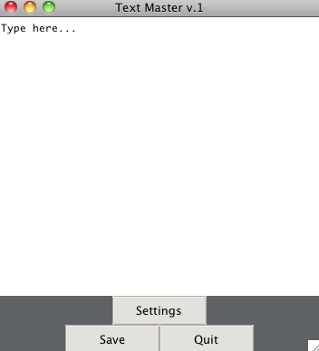

#TextMaster
A primitive text editor for the simple ones.

#Features
- Themes.
- Path direction.
- Custom text window size.

#Dependencies
###Python 3.4

#Setup
1. `cd` into desired directory.
2. Then `clone` this repo: `git clone https://github.com/blubrackets/TextMaster.git`.
3. `cd` into the directory you cloned.
4. Then `cd` into the `source` folder.
5. Run the script: `python3 textmaster.py`.

#Screenshot

